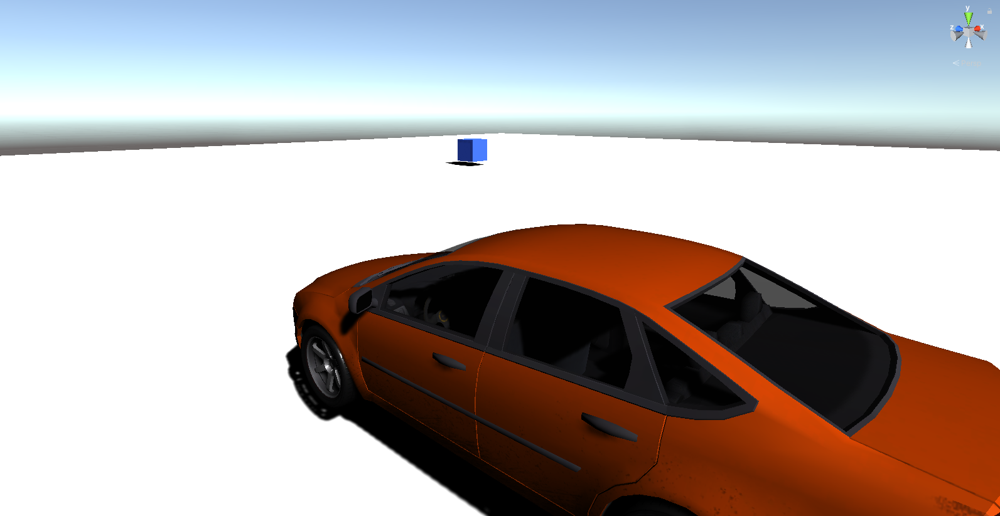
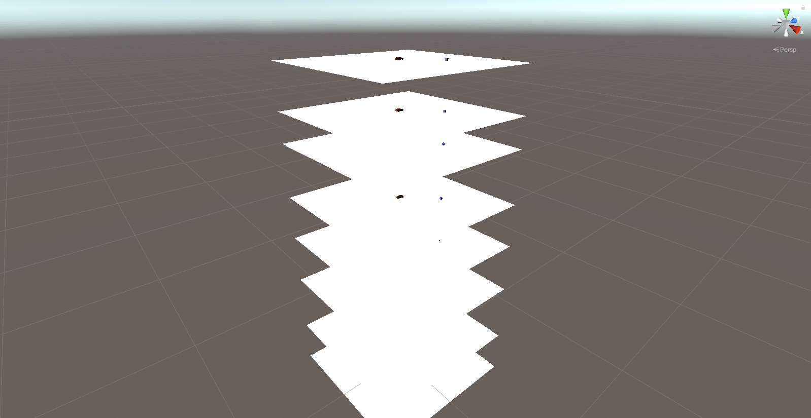
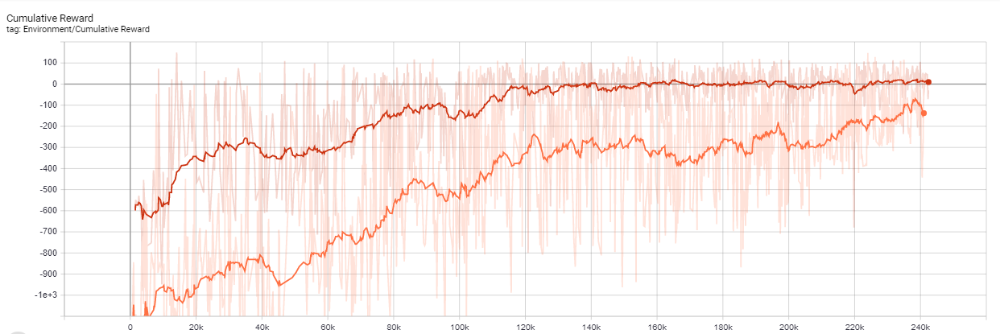
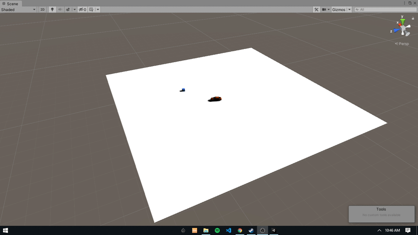

# Simple Self Driving Car Environment

### This is just the first stage of the project, second stage is here https://github.com/Manjunatha-b/Drift-Learner

Created using Unity and C#. Run trainer_config.yaml and when its listening on port, run the scene in unity to train. Or else insert CarBrain into NN model region of Car's Agent component to see my results. Or if you want python interface, Run pythonSide.py and when it is listening to port 5004, run the scene in unity.
 
 

### 1.) Environment Components:
1. <b>Car:</b> Simple car with mass set to 1000 and drag forces set to 0.05 through rigidbody settings. throttle is applied to all 4 wheels of the car with wheel collider component. maximum steering angle of 20 degrees. Always spawns in the same place. 
2. <b>Cube:</b> Is the target which the car tries to go towards. Will spawn randomly each episode. 
3. <b>Plane:</b> Simple plane which supports the car and cube with mesh collider. 

the above three components are added together into one object <b>"Prefab"</b> and duplicated 8 times to facilitate parallel learning of agents.(For PPO 8, SAC 4 was used)
 
 

### 2.) Reset conditions:
1. <b>Car falls of plane</b>: checks if y coordinate of plane is 2 units less than its initial position and resets.
2. <b>Car reaches target</b>: checks if car is within 3 units distance of the cube and resets
3. <b>Time Limit</b>: checks if time of epoch is greater than 12s. Helps cases where car is stuck as well.

### 2.) Problems faced:
List of problems faced that will be linked to the reason behind the reward system.

1. <b>Car falling:</b> After certain steps, the cars would and run straight to the edge of the plane to reduce loss.
2. <b>Car Circling:</b> After ~1,00,000 steps the cars would do 360s on the plane in hopes of minimizing the reward and randomly hit the target.
3. <b>Car Oscillating:</b> if the cube was parallel to the car, it would oscillate going back and forth next to it.
4. <b>No Noticeable Learning:</b> random decisions even after ~1,00,000 steps due to sparse rewards.

### 3.) Rewards:
1.<b>Cube Collision:</b> If the car reaches within a euclidian distance of 3 from the cube, a reward of 150 is granted. 
2.<b>Mean Distance:</b> reward of -(2.2*MSE b/w car and cube/10000) is added at each interval. 
3.<b>Angular Difference:</b> reward of -(angle b/w car's forward vector and cube location/360) is added at each interval.  
4.<b>Time Taken:</b> reward of -0.25 is added at each interval. 
5.<b>Car Falling:</b> reward of -300 is added if car falls of the edge of the plane.

### 4.) Environment states:
State of the environment is represented by a vector of size 5 where:
1. Position of car with respect to the cube are the first two elements
2. Angle of the car's forward vector with the cube is the 3rd element
3. Velocity of the car along x,y are the 4th and 5th elements respectively.

### 4.) Order of steps taken:

1. <b>Cube collision</b> and <b>Time taken</b> were the only rewards present first. this led to problem "1"
2. <b>Car Falling:</b> reward was added. This led to better results than before but still faced problem "4"
3. <b>Mean Distance:</b> reward was added. This led to significantly better learning but led to problems "2" and "3"
4. <b>Angular Distance:</b> reward was added. This was done with the intuition that if the system had an idea about the angle it would be able to reach a better decision. Led to significantly better results.

### 5.) The learning of the agent:

Used unity's PPO and SAC algorithm with default parameters to train the agent. took ~1 hour 20 minutes to reach a reasonable performance. The difference in algorithms is shown in the graph. SAC used only 4 instances of the game while PPO used 8 and SAC still managed to outperform by a significant margin. Red = SAC, Orange = PPO. X axis = steps, Y axis = Cumulative reward 
 

### 6.) Custom interfacing with python:

Created a template python script to call the environment and listen to it's inputs of observations and send rewards for future use.
This helps us to manually create models using any library and have more fine tuned control over the learning process.

### 7.) Result:

 

